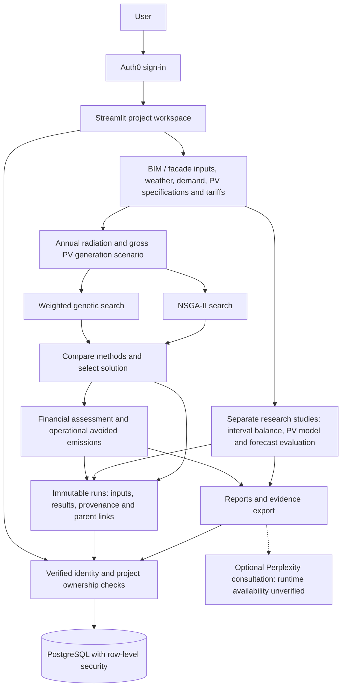

# BIPV Optimizer — implementation architecture

Status checked: 17 September 2026. This diagram describes the implemented PR #1 research workflow and the subsequently reported Replit candidate, **not a verified production deployment**. Repository baseline: `d3b5eb5a92940d8aa6447c12ad6ba553ca973f35`. Replit's latest recoverable candidate is `7903cd43deeaadcf2fd6eb70c3789d0507da2367`, with 409 source files and 70 passing isolated tests reported by Replit. Later Replit repairs require synchronization and release verification.

## Reading the diagram

- The workspace's project reads and writes, including research runs and report retrieval, are subject to ownership checks and database row-level security. The identity boundary applies throughout; it is not a final reporting step. PostgreSQL stores project inputs/current results and immutable run evidence; transient Streamlit session state is not the durable record.
- Annual optimization uses active area, irradiation and fractional efficiency. It compares weighted genetic search and NSGA-II using common scenario inputs and constraints. Evaluation counts and run time are reported; equal population/generation settings do not imply equal evaluation budgets.
- The selected method and solution feed the financial calculation. Annual netting is not measured or time-matched self-consumption. Do not infer that annual gross generation is a fully loss-adjusted AC prediction.
- Separate research studies cover timestamp-matched energy balances and finance, a pvlib-based PV model with optional measured comparison, and chronological forecast evaluation against a seasonal-naive baseline. They do not silently replace annual candidate rankings.
- Saved evidence retains inputs, results, model version, hashes and parent optimization links. Historical records require explicit verified ownership assignment; no user automatically claims legacy projects.

## Boundaries and items requiring direct verification

- Numerical regression tests do not establish empirical facade accuracy. Shading/thermal calibration, measured validation, multiple optimizer seeds and sensitivity analysis remain research work.
- Replit inspection reports a configurable assessment lifetime of 15–30 years, with 25 years as the default.
- Replit inspection confirms eligible-window/PV-element subset selection, not optimization of whole-building geometry.
- Carbon outputs estimate operational avoided emissions, not full lifecycle assessment. Perplexity consultation code exists; its direct-key implementation is not wired to the separately attached connector. The dashed edge denotes unverified runtime availability, not a validated research calculation.
- External weather/tariff sources require recorded provenance. An available adapter or API key is not proof that live requests succeed or that fallback data are suitable for research.
- Auth0 Free-plan billing was inspected separately; a successful dashboard administrator login does not validate application login/logout or two-account isolation.

## Release evidence and pending checks

GitHub baseline CI reported 57 passing tests. Replit subsequently reported successful restoration and migration rehearsals against database copies, preservation of project 126, runtime-lock alignment, and additional authentication/legacy-write repairs. These reports must be tied to the synchronized candidate revision before publishing. Latest Replit inspection reports a stopped preview, incomplete project-management/admin interfaces, unsuitable privileged production login roles, absent production ownership/RLS migration, unconfirmed exact production connection target, and unfinished source promotion/synchronization. Real-account logout and two-user checks and verified historical ownership assignment remain outstanding. The existing reporting dashboard must not be confused with the unfinished project-management/admin interfaces. Thirteen production projects and three backup-only projects (171–173) must be preserved without silent merging. No production readiness or deployment is claimed by this document.

Sources: [PR #1](https://github.com/mgabr2007/BIPVoptimizer/pull/1), [research workflow and setup](MULTIUSER_RESEARCH_SETUP.md), and Replit inspection reports in the associated work session. Update this document after candidate synchronization and verified deployment.
